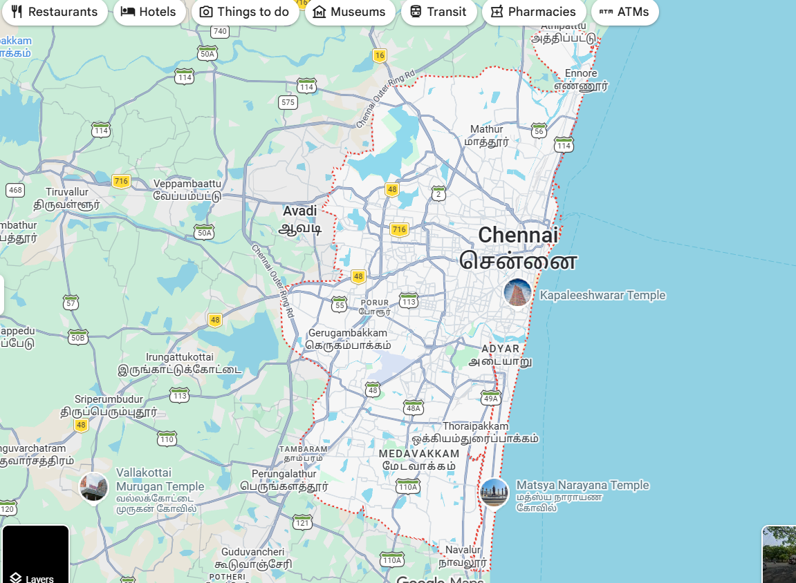
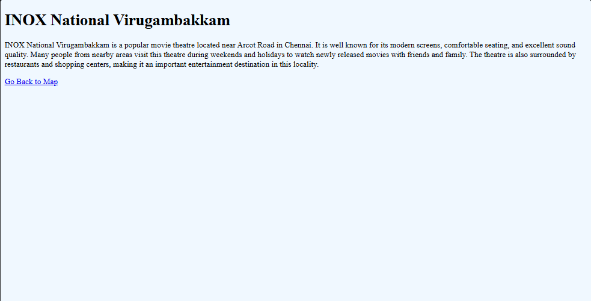
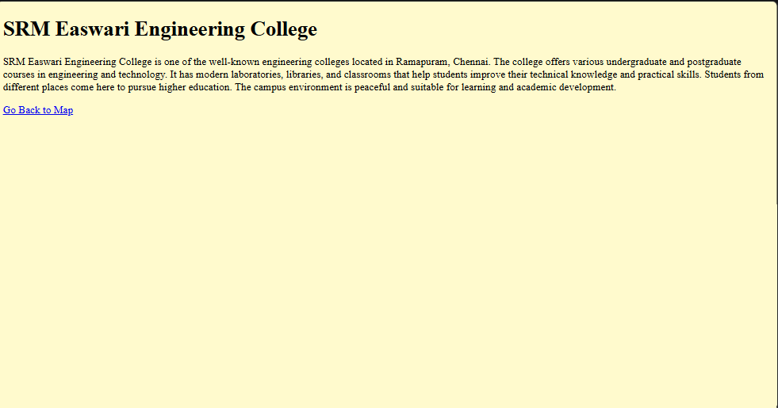
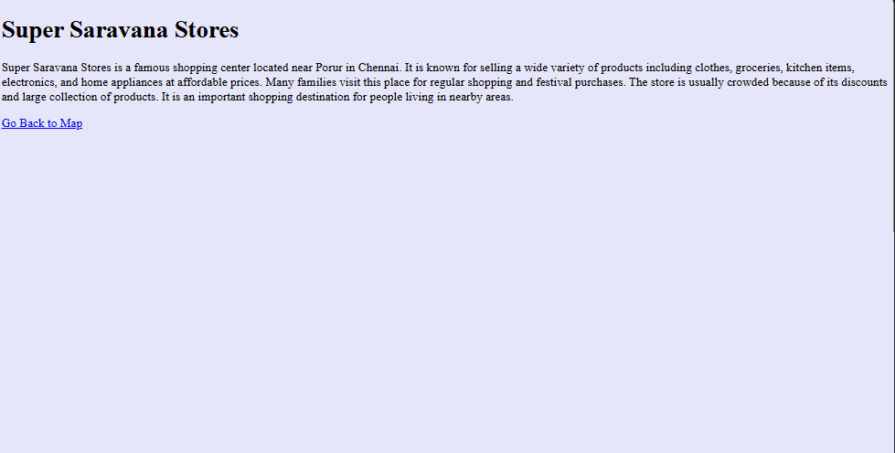
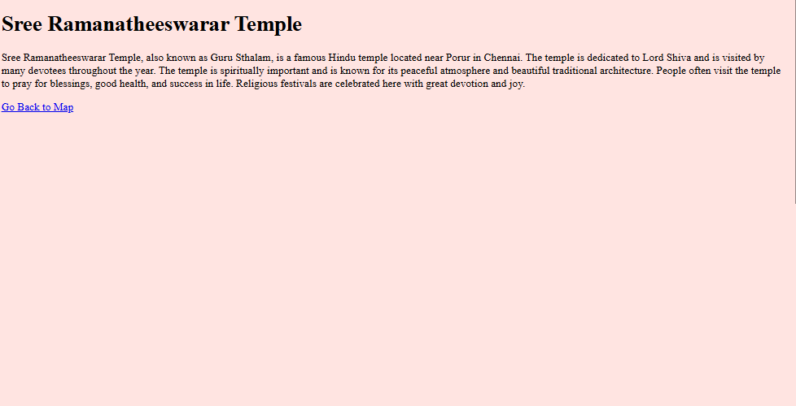
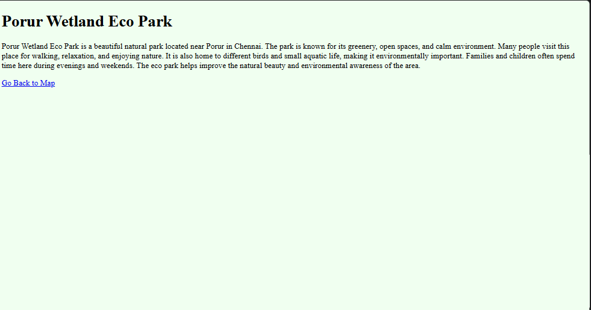

# Ex03 Places Around Me
## Date: 25.05.2026

## AIM
To develop a website to display details about the places around my house.

## DESIGN STEPS

### STEP 1
Create a Django admin interface.

### STEP 2
Download your city map from Google.

### STEP 3
Using ```<map>``` tag name the map.

### STEP 4
Create clickable regions in the image using ```<area>``` tag.

### STEP 5
Write HTML programs for all the regions identified.

### STEP 6
Execute the programs and publish them.

## CODE

---
place1.html 

<!-- place1.html -->

<!DOCTYPE html>
<html>
<head>
    <title>INOX National</title>
</head>

<body bgcolor="aliceblue">

    <h1>INOX National Virugambakkam</h1>

    <p>
        INOX National Virugambakkam is a popular movie theatre located near
        Arcot Road in Chennai. It is well known for its modern screens,
        comfortable seating, and excellent sound quality. Many people from
        nearby areas visit this theatre during weekends and holidays to watch
        newly released movies with friends and family. The theatre is also
        surrounded by restaurants and shopping centers, making it an important
        entertainment destination in this locality.
    </p>

    <a href="/">Go Back to Map</a>

</body>
</html>
---

---
place2.html
<!-- place2.html -->

<!DOCTYPE html>
<html>
<head>
    <title>SRM Easwari Engineering College</title>
</head>

<body bgcolor="lemonchiffon">

    <h1>SRM Easwari Engineering College</h1>

    <p>
        SRM Easwari Engineering College is one of the well-known engineering
        colleges located in Ramapuram, Chennai. The college offers various
        undergraduate and postgraduate courses in engineering and technology.
        It has modern laboratories, libraries, and classrooms that help
        students improve their technical knowledge and practical skills.
        Students from different places come here to pursue higher education.
        The campus environment is peaceful and suitable for learning and
        academic development.
    </p>

    <a href="/">Go Back to Map</a>

</body>
</html>

----

---

place3.html

<!-- place3.html -->

<!DOCTYPE html>
<html>
<head>
    <title>Super Saravana Stores</title>
</head>

<body bgcolor="lavender">

    <h1>Super Saravana Stores</h1>

    <p>
        Super Saravana Stores is a famous shopping center located near Porur
        in Chennai. It is known for selling a wide variety of products
        including clothes, groceries, kitchen items, electronics, and home
        appliances at affordable prices. Many families visit this place for
        regular shopping and festival purchases. The store is usually crowded
        because of its discounts and large collection of products. It is an
        important shopping destination for people living in nearby areas.
    </p>

    <a href="/">Go Back to Map</a>

</body>
</html>

---

---
place4.html

<!-- place4.html -->

<!DOCTYPE html>
<html>
<head>
    <title>Guru Sthalam Temple</title>
</head>

<body bgcolor="mistyrose">

    <h1>Sree Ramanatheeswarar Temple</h1>

    <p>
        Sree Ramanatheeswarar Temple, also known as Guru Sthalam, is a famous
        Hindu temple located near Porur in Chennai. The temple is dedicated to
        Lord Shiva and is visited by many devotees throughout the year. The
        temple is spiritually important and is known for its peaceful
        atmosphere and beautiful traditional architecture. People often visit
        the temple to pray for blessings, good health, and success in life.
        Religious festivals are celebrated here with great devotion and joy.
    </p>

    <a href="/">Go Back to Map</a>

</body>
</html>

----

----
place5.html

<!-- place5.html -->

<!DOCTYPE html>
<html>
<head>
    <title>Porur Wetland Eco Park</title>
</head>

<body bgcolor="honeydew">

    <h1>Porur Wetland Eco Park</h1>

    <p>
        Porur Wetland Eco Park is a beautiful natural park located near Porur
        in Chennai. The park is known for its greenery, open spaces, and calm
        environment. Many people visit this place for walking, relaxation, and
        enjoying nature. It is also home to different birds and small aquatic
        life, making it environmentally important. Families and children often
        spend time here during evenings and weekends. The eco park helps
        improve the natural beauty and environmental awareness of the area.
    </p>

    <a href="/">Go Back to Map</a>

</body>
</html>

---


## OUTPUT










## RESULT
The program for implementing image maps using HTML is executed successfully.
